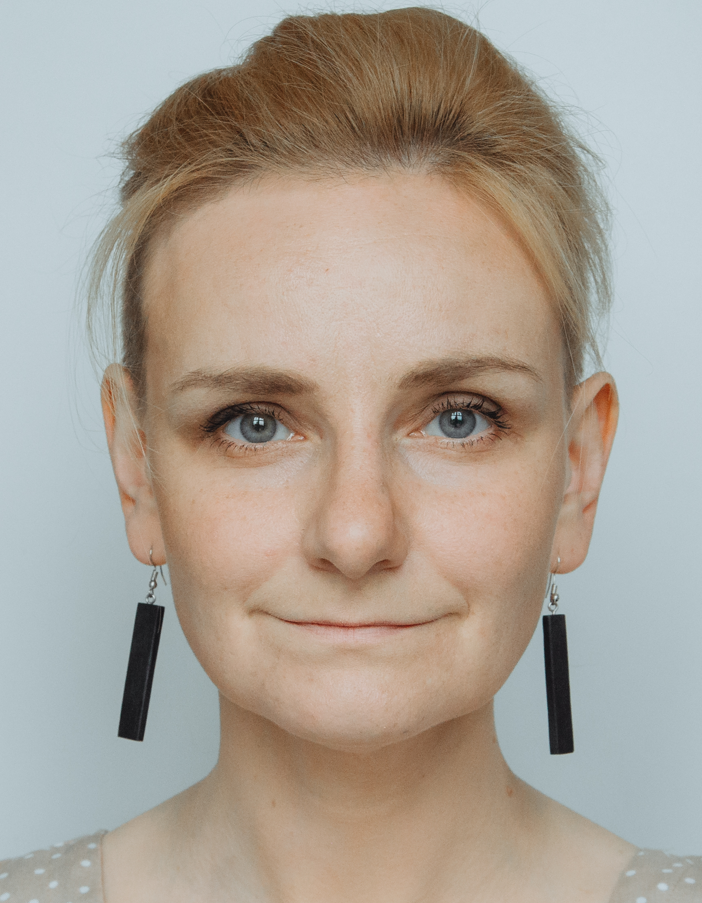

<div style="display: flex; align-items: flex-end; gap: 20px;">

  <div>
    
  </div>

  <div>
      <h1>Anna Vasilevich</h1>
    <ul>
      <li><b>GitHub:</b> <a href="https://github.com/dzichonka">dzichonka</a></li>
      <li><b>Phone:</b> +48 694 680 523</li>
      <li><b>LinkedIn:</b> <a href="https://www.linkedin.com/in/anna-vasilevich-frontend/">anna-vasilevich-frontend</a></li>
      <li><b>Discord:</b> Vasilisa (@dzichonka)</li>
      <li><b>e-mail:</b> <a href="mailto:anna.vasilevich.pl@gmail.com">anna.vasilevich.pl@gmail.com</a></li>
      <li><b>Telegram:</b> @dzichonka</li>
    </ul>
  </div>

  

</div>

---

### 👩‍🦳 About Me

Over the past year, I’ve built 15+ projects, including landing pages, SPAs, and web applications. My focus has been on React, TypeScript and Next: from developing new features to refactoring legacy code and migrating projects. I’ve worked with third-party APIs for authentication, product management, and data fetching. Additionally, I’ve solved 130+ Codewars challenges, sharpening my problem-solving skills in algorithms and data structures.

| Skills     | My strengths                                 |
| ---------- | -------------------------------------------- |
| JavaScript | Debugging with 100 `console.log`             |
| TypeScript | Finding type errors and ignoring them anyway |
| React      | Turning divs into components                 |
| NEXT       | Deploy → error → Google → profit             |
| Vitest     | Writing tests that only work on Fridays      |
| SASS       | Nesting selectors until infinity             |
| Tailwind   | Arguing if `bg-red-500` is red enough        |
| Git        | Creating 17 branches named `fix-final-final` |

### 🖋 Code example:

```
function becomeBorodinskiy() {
  let breads = ["🥖 baguette", "🥯 bagel", "🥐 croissant", "🍞 BORODINSKIY"];
  let random;
  let tries = 0;

  do {
    random = Math.floor(Math.random() * breads.length);
    console.log("You are:", breads[random]); // исправил вывод
    tries++;
  } while (breads[random] !== "🍞 BORODINSKIY");

  console.log("It took " + tries + " tries to finally become 🍞 BORODINSKIY 🎉");
}


becomeBorodinskiy();
```

---

### 💻 Experience

#### [E-commerce](https://rolling-scopes-school.github.io/dzichonka-JSFE2023Q4/coffee-house/) Online Pet-shop with React

#### [Rest Client](https://rest-client-app-tawny.vercel.app/en) Postman-like application with Next

#### [Bread Club](https://transcendent-chimera-1c5bd5.netlify.app/) App for Borodinskiy lovers

_[Look at another my projects...](https://dzichonka.github.io/)_

---

### 📚 Education

**RS School**

- React - _June 2025 - September 2025_
- JavaScript/Front-end - _October 2024 - June 2024_
- JavaScript/Front-end. Pre-school - _June 2024 - October 2024_

**Cosinus** - Medical electronics and informatics technician

- _September 2022 - June 2024 (Warsaw/Poland)_

**Cisco Networking Academy** - IT Essentials

- _November 2022 - October 2023 (On-line)_

**Belarusian State Economic University** - Finance and credit

- _September 2003 - June 2008 (Minsk/Belarus)_

---

### 😜 Languages

- **Belarusian** - native speaker
- **Russian** - native speaker
- **English** - B2
- **Polish** - B2
